# Benchmarks for Tarantool PHP connectors

This repository contains code to benchmark PHP connectors for [Tarantool](https://www.tarantool.io/).
Currently, there are two connectors available:

 * [tarantool/client](https://github.com/tarantool-php/client) written in pure PHP 
 * The official [PECL](https://github.com/tarantool/tarantool-php) extension
 
 > *Note*
 >
 > A more detailed explanation of the benchmarks represented in this repository can be found in [this article](https://habr.com/en/company/mailru/blog/480032/).


## Requirements

 * PHP 7.1+ (NTS and ZTS)
 * [Composer](https://getcomposer.org/)
 * [Tarantool](https://www.tarantool.io/) 1.7.1+
 * [ext-msgpack](https://github.com/msgpack/msgpack-php) to benchmark `Tarantool\Client\Packer\PeclPacker`
 * ext-async ([fork](https://github.com/dreamsxin/ext-async)) to benchmark connectors in async mode
 * [ext-parallel](https://github.com/krakjoe/parallel) to benchmark connectors in parallel mode
 * [ext-swoole](https://github.com/swoole/swoole-src) to benchmark connectors in async mode
 * [ext-tarantool](https://github.com/tarantool/tarantool-php) to benchmark the official PHP connector


## Usage

First, make sure you have the [bench.lua](bench.lua) instance running.

> If you want to run it on Docker, execute:
>
> ```bash
> docker run -d --network host --name=tarantool-bench \
>    -v $PWD/bench.lua:/bench.lua tarantool/tarantool:2 tarantool /bench.lua
> ```

Then run

```bash
make
```

to see the usage text and a list of all available benchmarks. For example, to (re)run all benchmarks, execute

```bash
make clean bench-all
```

> Alternatively, you may run benchmarks on Docker using Docker Compose: 
>
> ```bash
> docker-compose run --rm benchmarks make clean bench-all
> ```


You may change default benchmark settings by defining the following environment variables
(in parentheses are the default values):

 * `TNT_BENCH_TARANTOOL_URI` *(`tcp://localhost:3301`)*
 * `TNT_BENCH_TEMPLATE` *(`default.php.tpl`)*
 * `TNT_BENCH_ITERATIONS` *(`5`)*
 * `TNT_BENCH_REVOLUTIONS` *(`10000`)*
 * `TNT_BENCH_RETRY_THRESHOLD` *(`3`)*

For example:

```bash
make clean bench-all TNT_BENCH_REVOLUTIONS=20000 TNT_BENCH_RETRY_THRESHOLD=5 
```


## Results

The below results were made by running benchmarks on Apple MacBook Pro (2015) on the following environment: 

 * Linux Fedora 30, kernel 5.3.8-200.fc30.x86_64 
 * Tarantool 2.3.0-115-g5ba5ed37e running on Docker
 * Docker 19.03.3, build a872fc2f86
 * PHP 7.3.11 (cli) (built: Oct 22 2019 08:11:04) ( NTS )
 * PHP 7.3.11 (cli) (built: Oct 22 2019 08:11:04) ( ZTS )
 * tarantool/client 0.6.0
 * rybakit/msgpack 0.6.1
 * ext-tarantool 0.3.2 with the [patch](https://github.com/tarantool/tarantool-php/pull/148/files)
 * ext-msgpack 2.0.3
 * ext-async 0.3.0-8c1da46
 * ext-swoole 4.4.12
 * ext-parallel 1.1.3

#### Sync connectors
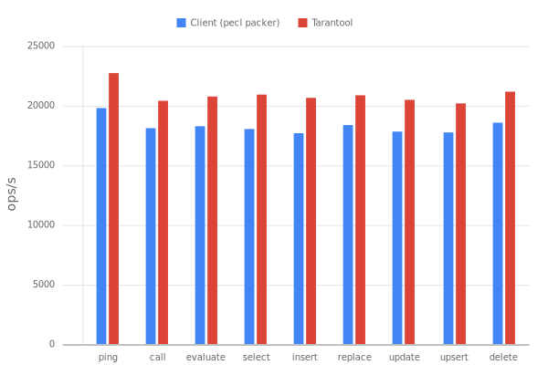

#### Sync client packers
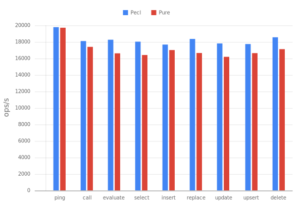

#### Sync client protocols
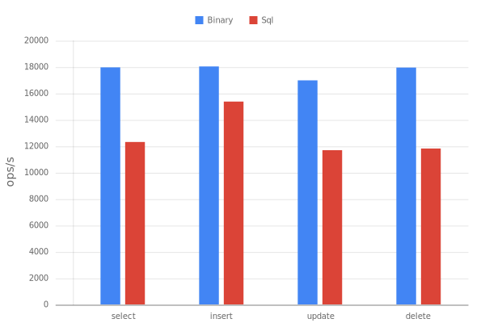

#### Async coroutines
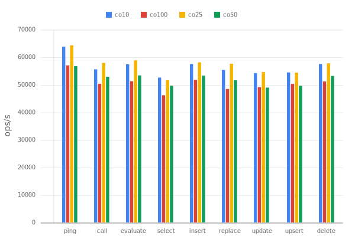

#### Async connectors
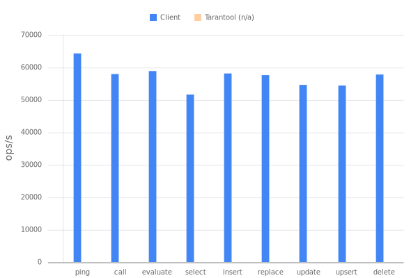

#### Async client protocols
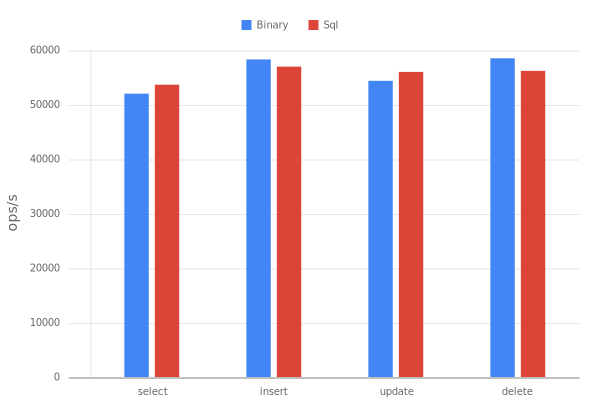

#### Swoole coroutines
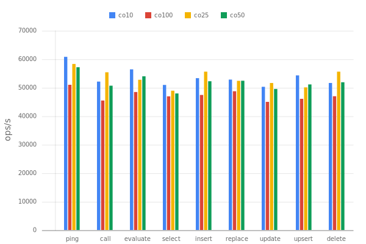

#### Swoole connectors
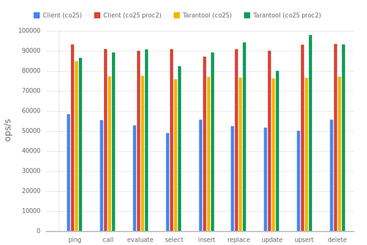

#### Swoole client protocols
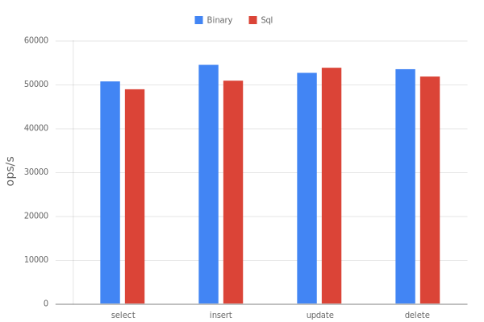

#### Parallel threads
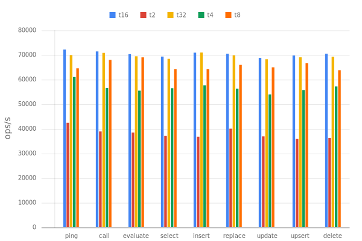

#### Parallel connectors
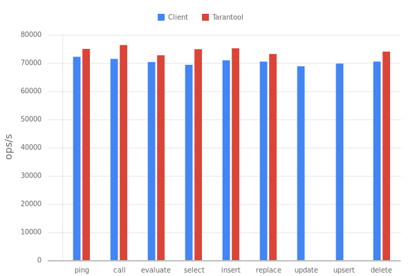

#### Parallel client protocols
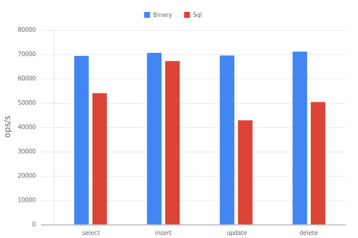

#### All extensions
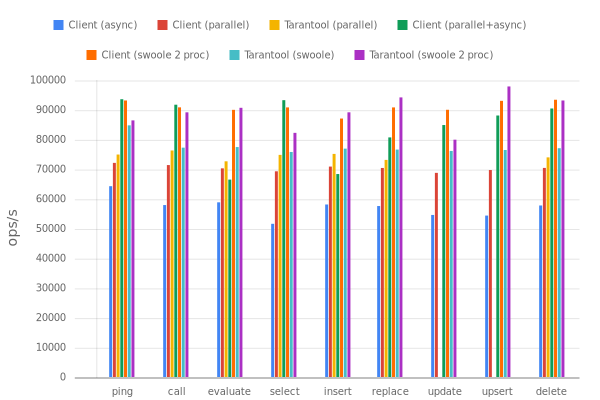


## License

The library is released under the MIT License. See the bundled [LICENSE](LICENSE) file for details.
